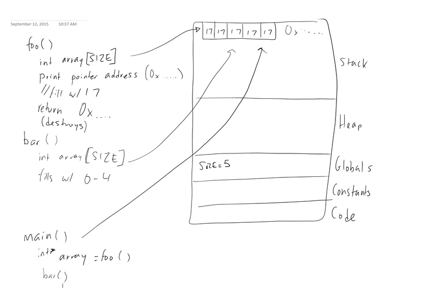

# Head First C - Chapter 2

**2. Read stack.c.  What is it intended to do?  What would the output be if the program worked as expected?**

What it is intended to do is print the array that gets created in foo(), the one that would look like [17,17,17,17,17].

**3. Compile it.  Do you get a warning?  What does it mean?**

```
The warning we get is 
stack.c:22:5: warning: function returns address of local variable [-Wreturn-local-addr]
     return array;
```

This is telling us that because foo()’s return type is an int pointer, the line return array; is returning not the array that we allocated but the pointer to the memory address of the first element of the array.  But, because array is a local variable, it’s not permanent and C is warning us that we’re returning a pointer to a memory address that’s going to get destroyed or dereferenced.

**4. Run it.  What happens?  Can you explain it?  Let's draw the stack diagram**

The program prints two memory addresses (one in function foo() and one in function bar()) and then the contents of the array in main(), which shows as 0, 1, 2, 3, 4.  

The reason for this is that, as the C warning told us, foo() is returning a reference to a local variable on the stack, which will get “forgotten” after foo() finishes running.  So then, in the line in main() that assigns int *array = foo();, it is actually assigning this array variable to the memory location on the stack that used to be occupied by the [17,17,17,17,17] array.  But then when we run bar(), because the array in foo() was local, bar sees that address space as free and re-writes its array into the same space.  This is also a local variable and gets “forgotten”, except that this behavior actually seems to change depending on the OS.  For Anne and Haley, running Ubuntu 14.04, the final loop in main() prints 0,1,2,3,4 (and when we comment out the call to bar(), it prints 17,17,17,17,17).  For Sophie, on MacOS, it would print random gigantic numbers and a string of zeros.  So it seems like the OS determines the way that it tries to access the “forgotten” memory space.  Ubuntu is more forgiving and seems to tell us what used to be in this location, even though it was local, whereas OSX seems more like taking an “it’s gone, too bad” attitude.  We also tried running the code in a CentOS VM to see how it behaved, and it was the same as Ubuntu, so we think it might be a Linux vs. UNIX thing.



This is our stack diagram sketch.  We filled in the locations in the stack with the original 17’s, but those get replaced in bar() when it fills the same location with 0-4.  ANd then at the bottom of main(), when it prints that location, it pulls from the memory address.

The way to fix this so that it behaves as expected (printing 17,17,17,17,17) is to allocate that space for our array so that it sticks around.  The way to do this is to replace the variable declaration in foo() with int* array = malloc(SIZE);

**5. Comment out the print statements in foo() and bar() and run it again.  What happens now?**

With the print statements, the programs seem to run with bar() overwriting the array in foo() in Ubuntu. We think this is due to undefined behavior due to the dangling pointer, but aren’t confident in why.
